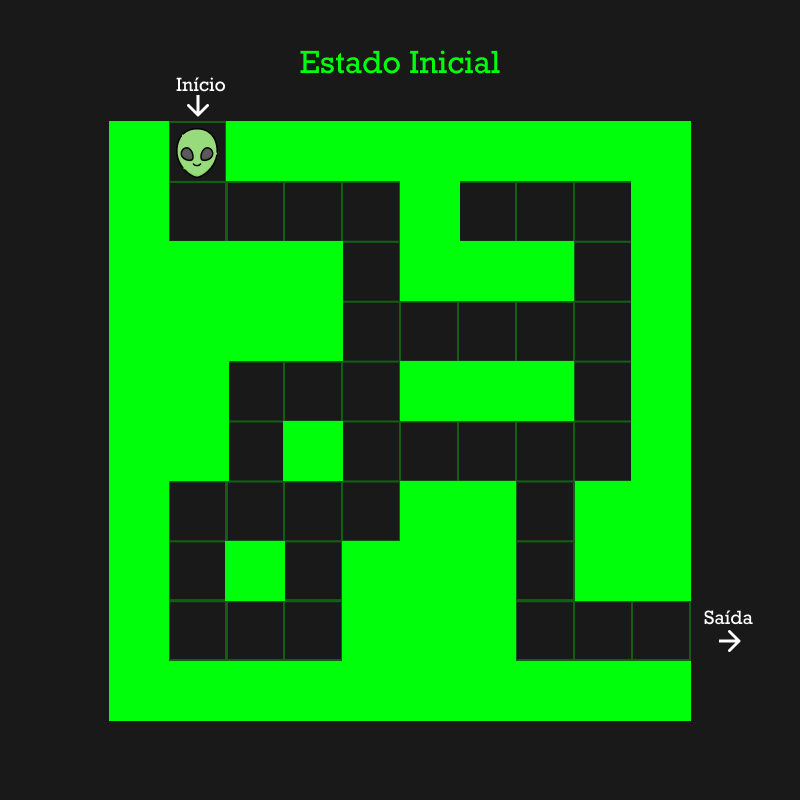
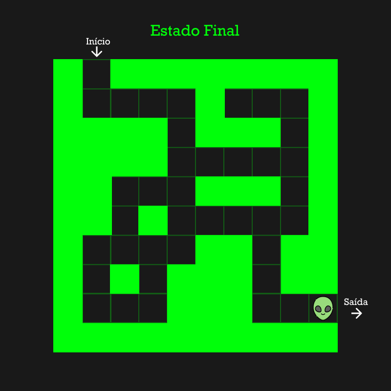

# Jogo Labirinto

Jogo de labirinto desenvolvido em Python para a disciplina de Inteligência Artificial.

## Estados do Jogo

## Representação Visual

Protótipos desenvolvidos com a ferramenta Figma. 

### 1 - Estado Inicial

### 2 - Estado Intermediário

### 3 - Estado Final

